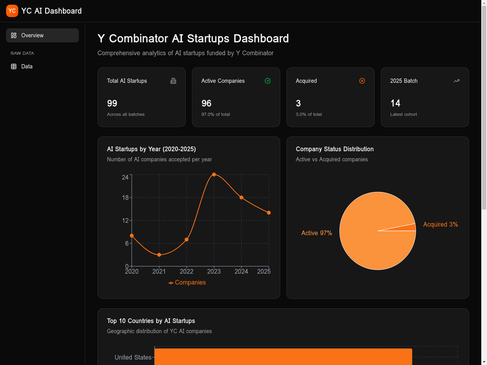
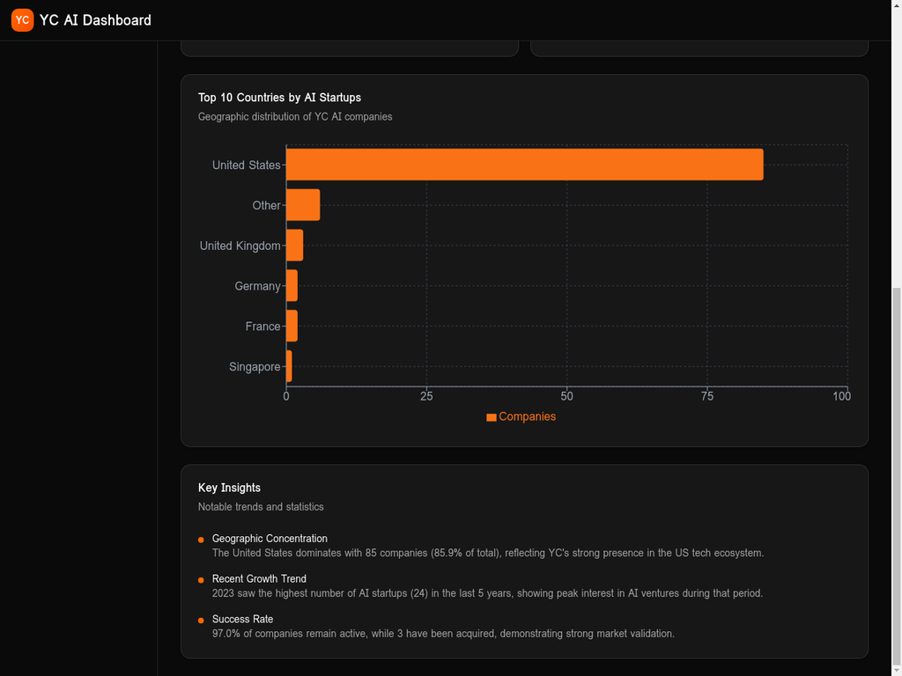
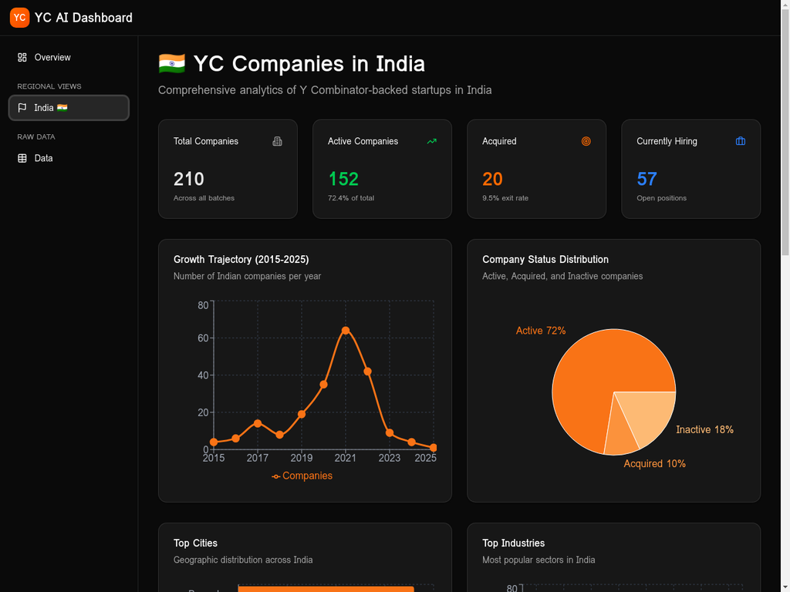
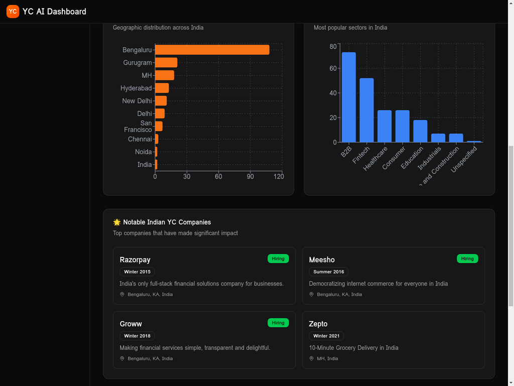
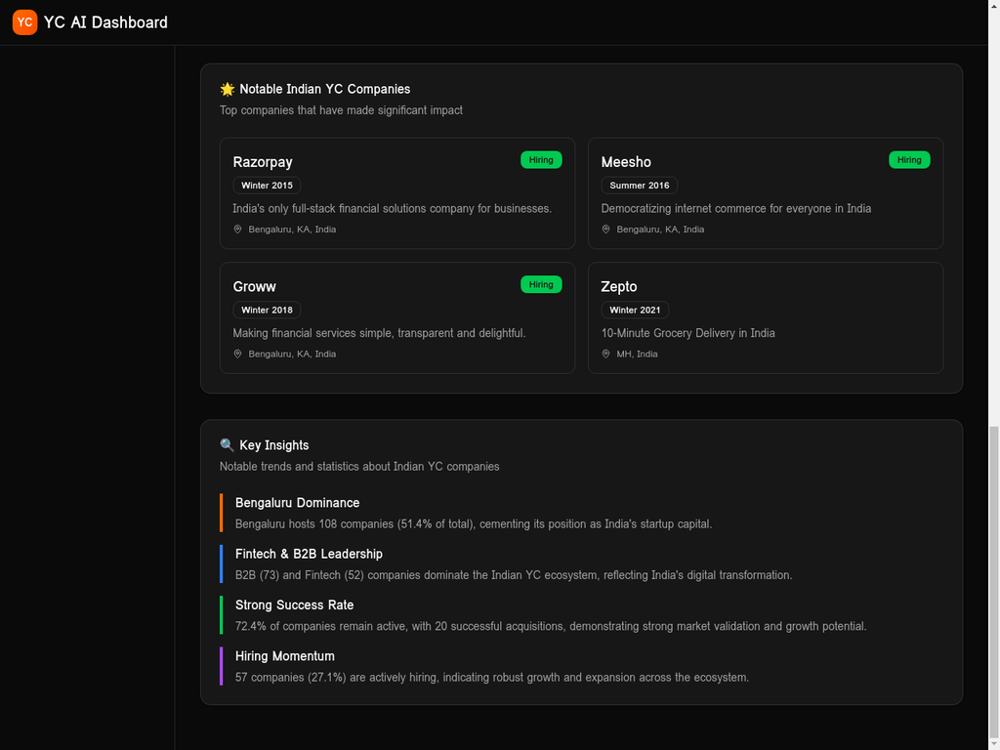

# YC AI Dashboard 🚀

> **Live Demo**: [https://sachinjain2000.github.io/yc-ai-dashboard](https://sachinjain2000.github.io/yc-ai-dashboard)

An interactive analytics dashboard visualizing Y Combinator's AI company portfolio with **real-time data** that updates daily, featuring comprehensive statistics, trends, and insights.

🔄 **Live Data**: Automatically fetches the latest AI company data from Y Combinator's database every day via the [unofficial YC API](https://github.com/yc-oss/api).

---

## 📊 Overview

The YC AI Dashboard provides comprehensive visualization and analysis of Y Combinator-backed AI companies. Built with modern web technologies, it offers an intuitive interface to explore company distributions, geographical trends, batch statistics, and success metrics across the YC AI ecosystem.

This dashboard transforms raw company data into actionable insights through interactive charts, real-time filtering, and detailed analytics—making it easy to understand the landscape of AI innovation emerging from Y Combinator.

---

## 📸 Screenshots

### Dashboard Overview

*Real-time analytics showing 849 AI startups, 735 active companies (86.6%), 47 acquisitions, and 200 companies in 2025 batch*

### Key Insights & Geographic Distribution

*Geographic concentration, growth trends, and success rate analysis*

### India Dashboard Overview

*210 YC companies in India with key metrics: Active (152), Acquired (20), Currently Hiring (57)*

### India Charts & Analytics

*City distribution (Bengaluru leads with 108 companies), industry breakdown, and notable companies*

### India Key Insights

*Notable companies (Razorpay, Meesho, Groww, Zepto) and data-driven insights about the Indian ecosystem*

---

## ✨ Features

### 📈 **Interactive Visualizations**
- **Bar Charts**: Company distribution by year, country, and batch
- **Pie Charts**: Status breakdown (Active, Acquired, Public, etc.)
- **Line Charts**: Growth trends over time
- **Geographic Analysis**: Top countries and regions for AI companies

### 🎯 **Key Metrics Dashboard**
- **Real-time data**: Automatically updated daily from YC's official database
- **849+ AI companies** tracked across all batches
- Total number of YC AI companies
- Year-over-year growth statistics
- Country-wise distribution
- Company status breakdown
- Batch-level analytics

### 🇮🇳 **Regional Views**
- **India Dashboard**: Dedicated view for 210+ YC companies in India
- City-wise distribution (Bengaluru, Gurugram, Hyderabad, etc.)
- Industry breakdown specific to Indian market
- Growth trajectory and hiring trends
- Notable companies: Razorpay, Meesho, Groww, Zepto
- Success rate and acquisition statistics

### 🔍 **Data Exploration**
- Raw data table view with sorting and filtering
- Search functionality across all company attributes
- Detailed company information cards
- Export capabilities for further analysis

### 🎨 **Modern UI/UX**
- Dark mode optimized interface
- Responsive design for all devices
- Smooth animations and transitions
- Accessible color schemes and typography

---

## 🛠️ Tech Stack

### Frontend
- **React 18** - Modern UI library with hooks
- **TypeScript** - Type-safe development
- **Vite** - Lightning-fast build tool
- **Wouter** - Lightweight client-side routing
- **Recharts** - Composable charting library
- **shadcn/ui** - High-quality UI components
- **TailwindCSS** - Utility-first styling

### State & Data
- **TanStack Query** - Powerful data fetching and caching
- **Framer Motion** - Smooth animations
- **Zod** - Runtime type validation

### Development
- **ESBuild** - Fast JavaScript bundler
- **PostCSS** - CSS transformations
- **Prettier** - Code formatting

---

## 📊 Data Source

This dashboard uses the **unofficial Y Combinator API** maintained by the open-source community:

- **API Repository**: [yc-oss/api](https://github.com/yc-oss/api)
- **Update Frequency**: Daily (automated via GitHub Actions)
- **Data Source**: Y Combinator's Algolia search index
- **Total Companies**: 5,548+ YC companies (849+ AI-tagged)
- **Coverage**: All publicly launched companies with YC pages
- **Last Updated**: Automatically synced every 24 hours

### API Endpoints Used

```typescript
// Fetch all AI-tagged companies
https://yc-oss.github.io/api/tags/artificial-intelligence.json

// API metadata
https://yc-oss.github.io/api/meta.json
```

The dashboard processes this data in real-time to generate:
- Company statistics by year, country, and status
- Growth trends and visualizations
- Searchable company directory
- Interactive analytics

**Note**: This is an unofficial API and not affiliated with Y Combinator. Data is sourced from publicly available information on the YC website.

---

## 🚀 Getting Started

### Prerequisites

- Node.js 22+ 
- pnpm (recommended) or npm

### Installation

```bash
# Clone the repository
git clone https://github.com/sachinjain2000/yc-ai-dashboard.git
cd yc-ai-dashboard

# Install dependencies
pnpm install

# Start development server
pnpm run dev
```

The dashboard will be available at `http://localhost:5173`

### Building for Production

```bash
# Create optimized production build
pnpm run build

# Preview production build locally
pnpm run preview
```

The build output will be in the `dist/` directory.

---

## 📁 Project Structure

```
yc-ai-dashboard/
├── client/                    # Frontend application
│   ├── public/               # Static assets
│   │   ├── yc_ai_companies.json    # Company data
│   │   ├── yc_ai_stats.json        # Aggregated statistics
│   │   └── mocks/                  # Mock data for development
│   ├── src/
│   │   ├── components/       # React components
│   │   │   ├── ui/          # shadcn/ui components
│   │   │   ├── DashboardLayout.tsx
│   │   │   ├── StatsCard.tsx
│   │   │   └── ...
│   │   ├── pages/           # Page components
│   │   │   ├── Home.tsx     # Main dashboard
│   │   │   └── RawData.tsx  # Data table view
│   │   ├── contexts/        # React contexts
│   │   ├── hooks/           # Custom React hooks
│   │   ├── lib/             # Utility functions
│   │   └── App.tsx          # Root component
├── server/                   # Backend (minimal, for future expansion)
├── shared/                   # Shared types and constants
├── package.json
├── vite.config.ts
└── README.md
```

---

## 📊 Data Schema

### Company Data Structure

```typescript
interface Company {
  name: string;           // Company name
  batch: string;          // YC batch (e.g., "W21", "S22")
  year: number;           // Year founded/joined YC
  status: string;         // Active, Acquired, Public, etc.
  location: string | null; // City location
  country: string | null;  // Country
}
```

### Statistics Structure

```typescript
interface Stats {
  total_companies: number;
  by_year: Record<string, number>;
  by_country: Record<string, number>;
  by_status: Record<string, number>;
}
```

---

## 🎨 Customization

### Theme Configuration

The dashboard uses a dark theme by default. To customize colors, edit `client/src/index.css`:

```css
:root {
  --primary: 20 14.3% 4.1%;
  --primary-foreground: 60 9.1% 97.8%;
  /* ... more theme variables */
}
```

### Adding New Visualizations

1. Create a new component in `client/src/components/`
2. Import Recharts components (Bar, Line, Pie, etc.)
3. Process data from the `useFetchData` hook
4. Add the component to `Home.tsx` or `RawData.tsx`

Example:

```tsx
import { BarChart, Bar, XAxis, YAxis, Tooltip } from 'recharts';

export function CustomChart({ data }) {
  return (
    <BarChart data={data}>
      <XAxis dataKey="name" />
      <YAxis />
      <Tooltip />
      <Bar dataKey="value" fill="#f97316" />
    </BarChart>
  );
}
```

---

## 🌐 Deployment

### GitHub Pages (Current)

The dashboard is deployed to GitHub Pages automatically:

1. Build the project: `pnpm run build`
2. Deploy contents of `dist/public/` to `gh-pages` branch
3. GitHub Pages serves the site at: `https://sachinjain2000.github.io/yc-ai-dashboard`

### Alternative Deployment Options

**Vercel**
```bash
vercel --prod
```

**Netlify**
```bash
netlify deploy --prod --dir=dist/public
```

**Docker**
```bash
docker build -t yc-dashboard .
docker run -p 3000:3000 yc-dashboard
```

---

## 📈 Key Insights

The dashboard reveals several interesting patterns in YC's AI portfolio:

- **Growth Acceleration**: Significant increase in AI companies post-2020
- **Geographic Concentration**: Strong presence in US, followed by emerging hubs
- **Status Distribution**: Majority of companies remain active and scaling
- **Batch Trends**: Seasonal patterns in company admissions and success rates

---

## 🤝 Contributing

Contributions are welcome! Here's how you can help:

1. **Fork the repository**
2. **Create a feature branch**: `git checkout -b feature/amazing-feature`
3. **Commit your changes**: `git commit -m 'Add amazing feature'`
4. **Push to the branch**: `git push origin feature/amazing-feature`
5. **Open a Pull Request**

### Development Guidelines

- Follow the existing code style (enforced by Prettier)
- Add TypeScript types for all new code
- Test your changes across different screen sizes
- Update documentation for new features

---

## 📝 Data Sources

The dashboard uses aggregated, publicly available data about Y Combinator companies. Data is updated periodically to reflect the latest information.

**Data Files:**
- `yc_ai_companies.json` - Individual company records
- `yc_ai_stats.json` - Pre-computed statistics for performance

---

## 🔮 Future Enhancements

- [ ] Real-time data updates via API integration
- [ ] Advanced filtering and search capabilities
- [ ] Company comparison tool
- [ ] Export to PDF/Excel functionality
- [ ] Historical trend analysis
- [ ] Funding round visualization
- [ ] Founder demographics insights
- [ ] Industry category breakdown

---

## 📄 License

This project is open source and available under the [MIT License](LICENSE).

---

## 👨‍💻 Author

**Sachin Jain**
- GitHub: [@sachinjain2000](https://github.com/sachinjain2000)
- LinkedIn: [sachinjain2000](https://linkedin.com/in/sachinjain2000)
- Email: sachin.jain@utdallas.edu

---

## 🙏 Acknowledgments

- **Y Combinator** for fostering innovation in AI
- **shadcn/ui** for beautiful, accessible components
- **Recharts** for powerful charting capabilities
- **The open source community** for amazing tools and libraries

---

<div align="center">
  
  **[View Live Dashboard](https://sachinjain2000.github.io/yc-ai-dashboard)** | **[Report Bug](https://github.com/sachinjain2000/yc-ai-dashboard/issues)** | **[Request Feature](https://github.com/sachinjain2000/yc-ai-dashboard/issues)**
  
  Made with ❤️ by Sachin Jain
  
</div>
